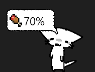

## A wonderful kitty desktop pet that brightens your day!

### And he does so much ✨✨ (just like a real cat!!!) 
He can sit! 
He can stand! 
He can run! 
He can <b>TALK</b>!! can a real cat even do that????? 
He can sleep! and so much much more

He will make your existance much more fun with fun facts, jokes and computering tips and tricks!! 
 

Leave him alone for some time and he'll start slithering across the screen in boredom! 
 

Or throw him around your screen because you can do that too!!! (i do not support animal cruelty in any way!!!) 
 
But whatever you do, do not forget that he's a <b>HUNGRY</b> fella, keep him fed please, you don't want trouble, do you :3 
 

### Umm to have your own kitty either compile the code yourself or download whatever's the [latest release](https://github.com/realvovan/ColonThreePet/releases) is uploaded on github
also right click the pet to close the program (for whatever reason you'd wanna do that 😒😒) 
 
<i>Cat images by [@sillycritterz](https://twitter.com/sillycritterz) on twitter :P